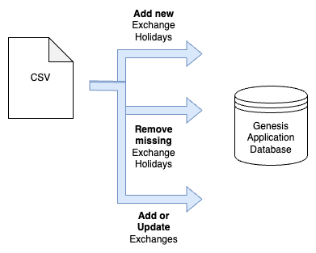

# howto-csv-ingress
This sample project demonstrates how to use Genesis Data Pipelines for CSV ingress. You can receive data, parse it and write it to the database of your Genesis Application.
There are three sample examples in this repo:
- **Simple CSV ingestion** is a very simple example that familiarises you with the basics of using a Data Pipeline to ingest CSV data.
- **Snapshot CSV file ingestion** is a more complex and realistic example that includes a StreamOperator with the ability to delete holidays that no longer apply.
- **Updating multiple entities** also includes a StreamOperator which maintains exchange data as well as the exchange holiday data from previous examples.

Find [full documentation on Data Pipelines](https://docs.genesis.global/docs/develop/server-capabilities/integrations/data-pipelines/)

## CSV Ingress Overview
All the examples here are based on ingesting market-holiday information from Copp Clark Exchange Holiday files, which are in CSV format.
The app also contains a basic UI so that you can actually view the data. But note that we shall not discuss the front-end code in this exercise.

## Simple CSV Ingestion
This example examines a simple CSV file, parses it, and upserts the Exchange Settlement Copp Clark file into the application's EXCHANGE_HOLIDAY table.

[`howto-csv-ingress-cc-simple-data-pipeline.kts`](server/howto-csv-ingress-app/src/main/genesis/scripts/howto-csv-ingress-cc-simple-data-pipelines.kts) contains the main configuration. Comments are inserted in the code to explain each key point.

The aim of this example is to highlight how simple it is to ingest the data. The example works, but it is missing real-world requirements:
- It assumes that the file is in a valid format in file. It will not generate errors gracefully if a row has missing or badly formatted data.
- It simply upserts records (inserts, else if present modifies). So, if you are using auditing, the audit trail can get very busy unless you typically expect delta files (where each new file contains only additions and modifications from the previous version).
- It only adds a log entry upon completion, it does not notify anyone.

### How do I try it?
Run the app and then copy files from [sampleData/simple](server/howto-csv-ingress-app/src/test/resources/sampleData/simple) into [localDevFileDrop/coppClarkSimple](localDevFileDrop/coppClarkSimple).

See the `HOWTO_CSV_INGRESS_MANAGER` logs for logged details.
> ⚠️ If you have enabled Compact Processes, you'll need to look at the `HOWTO_CSV_INGRESS_COMPACT_PROCESS` logs

To view the data, run the GUI or use the Genesis DbMon utility.

## Snapshot CSV File Ingestion
This example shows something a bit more robust, and looks at the nuances of Copp Clark files:
- The file sent each day is a full snapshot of holidays. If the latest file does not include a holiday that was present in the previous version, then it must be deleted.
- There are two separate files, one for Trading and one for Settlement. Each file can contain multiple lines for the same holiday date on a given exchange. In our app, we only need to know if a given date is a holiday, and for this reason we key the exchange table on just Holiday Type (Settlement vs Trading) + ISO MIC (the Exchange) and Holiday Date in our EXCHANGE table definition, so we don't need the redundant lines.

Our simple example would fail on the first point, as it wouldn't know to manually delete an EXCHANGE_HOLIDAY record. It might also behave a little strangely or inefficiently on the second point, because multiple rows would overwrite each other constantly on each upload.
 
Three further things elevate this snapshot above the simple one:
- It only writes updates if something has changed (whereas the simple example simply upserts with the same data each time).
- It additionally notifies users a file has been ingested using the Genesis Notify component.

[`howto-csv-ingress-cc-snapshot-data-pipeline.kts`](server/howto-csv-ingress-app/src/main/genesis/scripts/howto-csv-ingress-cc-snapshot-data-pipelines.kts) contains the main configuration. Comments are inserted in the code to explain each key point.

### Using StreamOperator
Another important difference between this example and the simple one is that we have created a custom operator outside the pipeline, which transforms data as needed for this use case, and is included as an operator within the pipeline. This avoids bloating the pipeline with mapping logic to keep the pipeline more readable.

See the [`CoppClarkHolidayTransformer.kt`](server/howto-csv-ingress-app/src/main/kotlin/howto/csv/ingress/copp/clark/transform/CoppClarkHolidayTransformer.kt) for this custom operator's transformation logic. Comments are inserted in the code to explain each key point.

### How do I try it?
Run the app and then copy files from  [sampleData/snapshot](server/howto-csv-ingress-app/src/test/resources/sampleData/snapshot) into [localDevFileDrop/coppClarkSnapshot](localDevFileDrop/coppClarkSnapshot).

See the `HOWTO_CSV_INGRESS_MANAGER` logs for logged details. To view the data, run the GUI or use the Genesis DbMon utility.
> ⚠️ If you have enabled Compact Processes, you'll need to look at the `HOWTO_CSV_INGRESS_COMPACT_PROCESS` logs

## Updating multiple entities from a single source

You might wish to be able to modify more than one type of entity record from your file upload. This example is an extension of the previous Snapshot CSV file example. Additionally, it maintains EXCHANGE data, which is contained in every row of the inbound files. So, it ensures that there is an EXCHANGE entry for every calendar we're adding.

[`howto-csv-ingress-cc-snapshot-exchange-data-pipelines.kts`](server/howto-csv-ingress-app/src/main/genesis/scripts/howto-csv-ingress-cc-snapshot-exchange-data-pipelines.kts)
contains the configuration. This file is very similar to the [`howto-csv-ingress-cc-snapshot-data-pipeline.kts`](server/howto-csv-ingress-app/src/main/genesis/scripts/howto-csv-ingress-cc-snapshot-data-pipelines.kts) example. So, the comments in the file are exclusively focused on the logic that is related to exchange data.

The main difference is in the accompanying Transformer class it uses - [`CoppClarkHolidayAndExchangeTransformer.kt`](server/howto-csv-ingress-app/src/main/kotlin/howto/csv/ingress/copp/clark/transform/CoppClarkHolidayAndExchangeTransformer.kt) - the main point to note is the StreamOperator output is of type `DbOperation<out TableEntity>`. This means it can be a DbOperation on any database type. Here we have just two table entities, but it could be any mix of entities in our application.

### How do I try it?
Run the app and then copy files from [sampleData/snapshot](server/howto-csv-ingress-app/src/test/resources/sampleData/snapshot) into [localDevFileDrop/coppClarkSnapshotExchange](localDevFileDrop/coppClarkSnapshot).

See the `HOWTO_CSV_INGRESS_MANAGER` logs for logged details Run the GUI or DbMon utility to view data
> ⚠️ If you have enabled Compact Processes, you'll need to look at the `HOWTO_CSV_INGRESS_COMPACT_PROCESS` logs

### Running a pipeline gpal script in your own application
When you want to create a Data Pipeline in your own application, there are other things you need to do in addition to creating the pipeline files that you see in the examples above.
See [`howto-csv-ingress-processes.xml`](server/howto-csv-ingress-app/src/main/genesis/cfg/howto-csv-ingress-processes.xml) by way of example. You need to change this MANAGER process to include the pipeline:
- Add `genesis-pal-datapipeline` to `<module>`
- Add `global.genesis.pipeline` to `<package>`
- Add the relevant gpal script (e.g. [`howto-csv-ingress-cc-simple-data-pipeline.kts`](server/howto-csv-ingress-app/src/main/genesis/scripts/howto-csv-ingress-cc-simple-data-pipelines.kts)) to `<script>`

You should also be aware of [`genesis-system-definition.kts`](server/howto-csv-ingress-app/src/main/genesis/cfg/genesis-system-definition.kts) items listed which are referenced by pipelines and point the pipeline to the location it needs to source files from. 

If you are using the Genesis Notify service, you also need to:
- Add `global.genesis.notify.api.service` to `<package>`
- Add `implementation("global.genesis:genesis-notify-pipelines:${properties["notifyVersion"]}")` to `<project>-app/src/build.gradle.kts`

# I need something else?
If you require your Genesis app to perform functionality related to csv ingestion which is not covered by this application, please search  the community with details via the [Genesis Stack Overflow](https://stackoverflowteams.com/c/genesis-global/questions). If you are still unsure try posting a question using the tag `csv-ingress`

# License
This is free and unencumbered software released into the public domain. For full terms, see license.

**NOTE** This project uses licensed components listed in the next section, thus licenses for those components are required during development.

## Licensed components
Genesis low-code platform
# Test results
BDD test results can be found [here](https://genesiscommunitysuccess.github.io/howto-csv-ingress/test-results)
